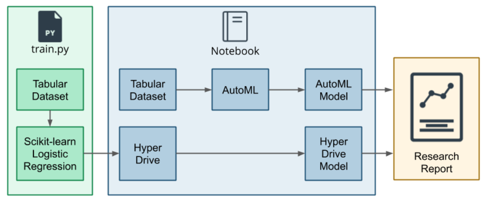
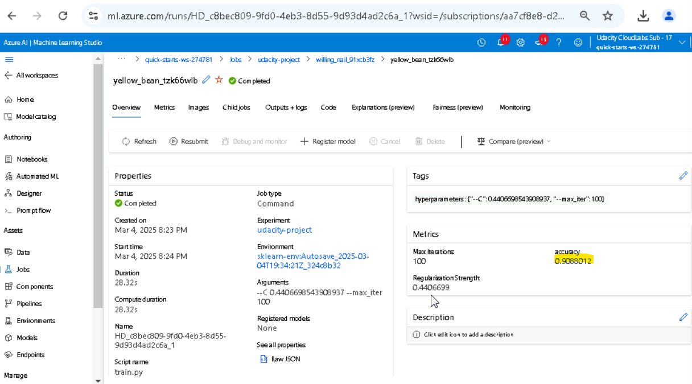
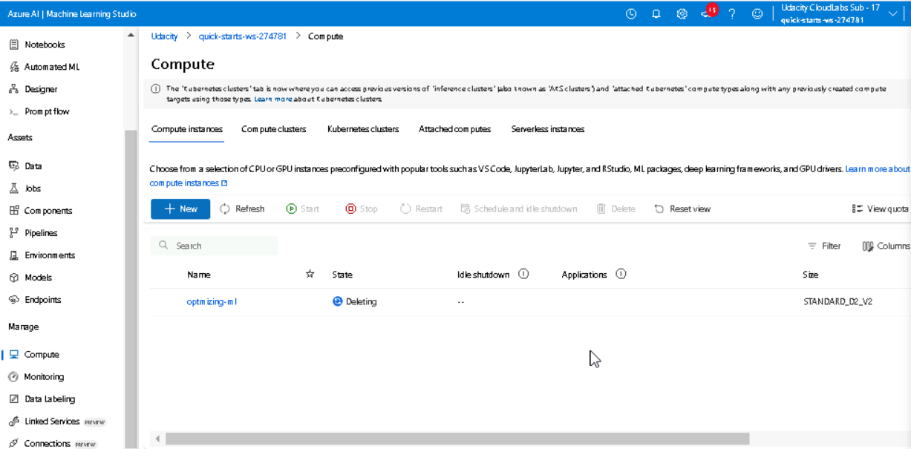

# Optimizing an ML Pipeline in Azure

## Overview
This project is part of the Udacity Azure ML Nanodegree.
In this project, we build and optimize an Azure ML pipeline using the Python SDK and a provided Scikit-learn model.
This model is then compared to an Azure AutoML run.

## Pipeline Architecture
You can see the Pipeline Architecture in the image below:

### Step 1: Train Script Setup and Dataset Preparation
- Set up the training script (`train.py`) to load and preprocess the dataset.
- Create a **Tabular Dataset** using the `TabularDatasetFactory` to load the data from the provided URL.
- Evaluate the dataset using a custom **Scikit-learn Logistic Regression model**.

### Step 2: Hyperparameter Tuning with HyperDrive
- Create a **Jupyter Notebook** to orchestrate the experiment (udacity-project.ipynb).
- Use **HyperDrive** to automate the search for the best hyperparameters for the Logistic Regression model.
- Define the hyperparameter search space and apply an early stopping policy to optimize the training process.

### Step 3: Model Optimization with AutoML
- Load the same dataset in the Notebook using the `TabularDatasetFactory`.
- Use **AutoML** to automatically test multiple machine learning models and select the best-performing one.
- Compare the results of the AutoML model with the Logistic Regression model tuned by HyperDrive.

### Step 4: Results Comparison and Reporting
- The best HyperDrive model, Logistic Regression, achieved an accuracy of 90.88%, while the top AutoML model, VotingEnsemble, demonstrated a slightly higher accuracy of 91.67%. Although the VotingEnsemble outperformed the Logistic Regression, the difference in accuracy between the two models is not statistically significant. This suggests that both models exhibit comparable performance, allowing practitioners to choose based on other factors such as computational efficiency or ease of implementation.
- Document the findings, insights, and conclusions in a research report (this README file).

## Useful Resources
- [ScriptRunConfig Class](https://docs.microsoft.com/en-us/python/api/azureml-core/azureml.core.scriptrunconfig?view=azure-ml-py)
- [Configure and submit training runs](https://docs.microsoft.com/en-us/azure/machine-learning/how-to-set-up-training-targets)
- [HyperDriveConfig Class](https://docs.microsoft.com/en-us/python/api/azureml-train-core/azureml.train.hyperdrive.hyperdriveconfig?view=azure-ml-py)
- [How to tune hyperparamters](https://docs.microsoft.com/en-us/azure/machine-learning/how-to-tune-hyperparameters)

## Summary
This project aims to compare the results of using **HyperDrive** and **AutoML** in Azure Machine Learning. The dataset contains data about bank marketing campaigns, and the goal is to predict whether a client will subscribe to a term deposit (binary classification).

- **Best HyperDrive Model**: Logistic Regression with an accuracy of **90.88%**.
- **Best AutoML Model**: VotingEnsemble with an accuracy of **91.67%**.

**Comparison between models**:
The best HyperDrive model, Logistic Regression, achieved an accuracy of 90.88%, while the top AutoML model, VotingEnsemble, demonstrated a slightly higher accuracy of 91.67%. Although the VotingEnsemble outperformed the Logistic Regression, the difference in accuracy between the two models is not statistically significant, suggesting that both models exhibit comparable performance

Below, there is a GUI image from the best Hyperdrive model:

The results from all the AutoML model can be found in the notebook cell outputs of `udacity-project.ipynb` (the orchestrator notebook).

## Scikit-learn Pipeline
### Pipeline Architecture:
1. **Data Loading**: The dataset is loaded using the `TabularDatasetFactory` from a URL.
2. **Data Cleaning**: The `clean_data` function is applied to handle missing values, encode categorical variables, and prepare the data for training.
3. **Hyperparameter Tuning**: HyperDrive is used to optimize the hyperparameters of the Logistic Regression model. The hyperparameters tuned are:
   - `C`: Inverse of regularization strength.
   - `max_iter`: Maximum number of iterations for convergence.
4. **Classification Algorithm**: A Logistic Regression model is trained using Scikit-learn.

### Parameter Sampler:
- **RandomParameterSampling**: This method randomly samples hyperparameters from a defined search space. It is efficient and allows for the exploration of a wide range of values without being exhaustive. Compared to Grid Search, which evaluates every combination of parameters, RandomParameterSampling can significantly reduce computation time and resources, especially when dealing with large search spaces.

### Early Stopping Policy:
- **BanditPolicy**:  This policy stops runs that are not performing well based on a slack factor. It helps save computational resources by terminating underperforming runs early. In contrast to other methods like EarlyStoppingPolicy, which may rely on a fixed number of iterations or validation performance thresholds, the BanditPolicy is more dynamic and adapts based on the performance of ongoing trials.

## AutoML
### Data Preparation:
1. **Data Cleaning**: The `clean_data` function is applied to clean and preprocess the dataset.
2. **Column Name Adjustment**: To ensure compatibility with the `TabularDatasetFactory` and AutoML, the names of the columns were adjusted by replacing dots (`.`) with underscores (`_`). This step was necessary to pass the dataset validation and allow the model to run successfully in AutoML.
3. **Dataset Registration**: The cleaned and adjusted dataset is saved using `Dataset.Tabular` and passed to AutoML for training.
### Model and Hyperparameters:
AutoML automatically tested several models, including Random Forest, Gradient Boosting, and Logistic Regression. The best model generated by AutoML was a **VotingEnsemble**, with hyperparameters optimized for accuracy.

## Pipeline comparison
- **Accuracy**: The Logistic Regression model optimized with HyperDrive achieved an accuracy of **90.88%**, while the AutoML model achieved an accuracy of **91.67%**.
- **Architecture**: The HyperDrive pipeline focused on tuning a single model (Logistic Regression), while AutoML explored multiple models and selected the best one.
- **Differences**: The difference in accuracy is minimal and does not appear to be statistically significant. This suggests that both approaches are equally effective for this specific problem.

## Future work
1. **Feature Engineering**: Explore additional feature engineering techniques to improve model performance.
2. **Hyperparameter Tuning**: Use a more exhaustive search method, such as Grid Search, for hyperparameter tuning.
4. **Increased Iterations and Hyperparameters**: In this project, the model was trained with a limited number of iterations and hyperparameter combinations to prioritize speed. However, it may be worthwhile to explore more iterations and hyperparameter combinations to potentially achieve better results.

## Proof of cluster clean up
I used more than one user to complete the course project. The last cluster related to the final stage of development was deleted, as shown in the attached image. However, it is necessary to verify if there are other clusters in my user that were created earlier during the initial stages of development and need to be deleted.

